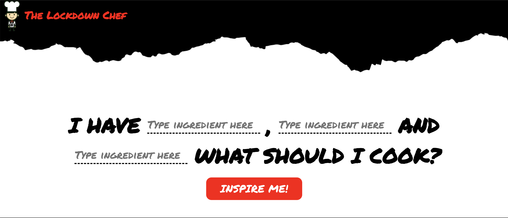
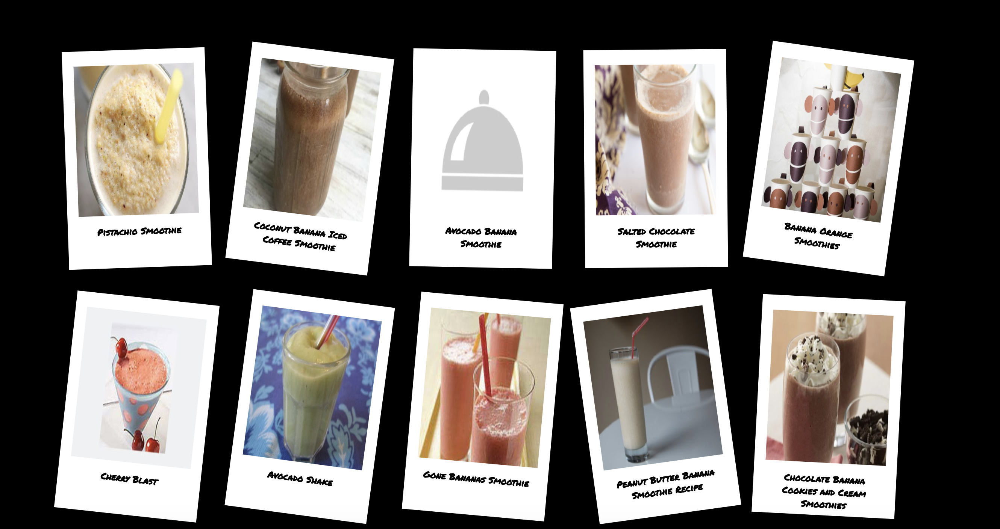

# sei-project-two
 
General Assembly Project 2: Hackaton, make an app - The Lockdown Chef
 
## https://lockdown-chef.netlify.app/
 
## Goal:
Hackaton of 2 days to create an app with React.js, Axios, and an online API pair coding.
 
Timeframe: 48 hours
 
## Table of Contents
 
- [Overview](#overview)
- [Technologies](#technologies)
- [Process](#process)
- [Challenges](#challenges)
- [Win](#wins)
- [Lessons Learned](#lesson)
 
## Overview
 
This project was the first time coding along with a partner. My partner and I decided to make an app about recipes, where you write the ingredients you have at home, to make dishes.
 
## Technologies
 
- React.js
- Axios
- CSS
- React router dom
- Git / GitHub
- Yarn
- Insomnia
- Netlify
 
## How to use it
 
In the middle of the screen you have input where you can write a maximum of 3 ingredients, you have to put at least one to find a recipe. After you write your ingredients, you only have to press the button and it should appear recipes with the ingredients you choose.
 
## Process
 
The starting point was to find an API with ingredients recipes for our app, we find Spoonacular a wonderful food API, which a great number of recipes and we can filter them with the ingredients. Also, it is a free API if you don't do more than 100 requests per month.
 
After we got our API we started to design our App, we made a simple design with a logo and the name of the app. First, we requested with Axios to get the recipes, we checked with Insomnia if we received the recipes, later we put some text inputs for the fill the ingredients to filter the recipes.
 

 
Firstly, I started making the design of the App with HTML5 and CSS, while my partner was making a logo for the app. After we have the design of the app. We started to request the API to get the recipes, we figured out that we need to make 2 requests, one to filter the recipes with the ingredients and the last one to get all the data of those recipes (name, ingredients, how to make it) so then we adjust the URL to get the recipes to filter by ingredients and then we created a function to that join the ingredients in a string to filter the recipes.
 
 
```
class Main extends React.Component {
 state = {
   userChoices: {
     dish: '',
     ingredient1: '',
     ingredient2: '',
     ingredient3: ''
   },
   recipes:[]
 }
 
handleChange = (event) => {
   this.setState({ userChoices:{...this.state.userChoices, [event.target.name]: event.target.value }})
 };
 
 
handleSubmit = async (event, { ingredient1, ingredient2, ingredient3 }=this.state.userChoices) => {
 event.preventDefault()
 
 try {
 
 const userIngredients = []
 
   // Check which ingredients have been filled, take from the state
 
 if (ingredient1) {
 userIngredients.push(ingredient1)}
 
 if (ingredient2) {
 userIngredients.push(ingredient2)}
 
 if (ingredient3) {
 userIngredients.push(ingredient3)}
 
 
 const ingredientsString = userIngredients.join(',+')
 
 
 
   // API request to get list of recipes
   const res = await axios.get(`https://api.spoonacular.com/recipes/findByIngredients?apiKey=${process.env.REACT_APP_SPOONACULAR_KEY}&ingredients=${ingredientsString}&number=10`)
   // Take out the id of each recipe
   const recipeIds =  res.data.map(recipe => recipe.id)
   // console.log(res.data)
   // console.log(recipeIds) // This works!
   const getSingleRecipe = async (id) => { 
     const res = await  axios.get(`https://api.spoonacular.com/recipes/${id}/information?apiKey=${process.env.REACT_APP_SPOONACULAR_KEY}&includeNutrition=false`)
     return res.data
   }
   const recipeData = await Promise.all(recipeIds.map( id => getSingleRecipe(id)))
 
 
   this.setState({recipes: recipeData})
 
 } catch (err) {
   console.log(err)
 }
}
 
 render() {
   // console.log(this.state)
   return (
   <main className="main">
     <div className="top">
     <form onSubmit={this.handleSubmit}>
       <div className="text">
       <h3>I HAVE </h3>
           <input className="input"
           placeholder="Type ingredient here"
           onChange={this.handleChange}
           name="ingredient1"
           value={this.state.userChoices.ingredient1}/>
           <h3> ,  </h3>
           <input className="input"
           placeholder="Type ingredient here"
           onChange={this.handleChange}
           name="ingredient2"
           value={this.state.userChoices.ingredient2}/>
           <h3> AND </h3> 
           <input
           className="input"
           placeholder="Type ingredient here"
           onChange={this.handleChange}
           name="ingredient3"
           value={this.state.userChoices.ingredient3}/>
           <h3> WHAT SHOULD I COOK? </h3>
         </div> 
       <div className="button">
         <button onSubmit={this.handleSubmit} type="submit">INSPIRE ME!</button>
       </div>
     </form>
     </div>
     <div className="bottom">
     {this.state.recipes.map(recipe => (
     <RecipeCard
       key={recipe.id}
       title={recipe.title}
       image={recipe.image}
       sourceUrl={recipe.sourceUrl}/>
     ))}
     </div>
   </main>
   )
 }
 
}

export default Main
```

Finally, we worked into making the appear the information of the recipes and we styled; images, name of the recipes, and a link to the recipe to make the food.



## Wins

The biggest win was to use 2 URL APIs to get the recipes with all the data we need. Also to limit the number the recipes you receive with the ingredients selected before we received hundreds of recipes so we limited to 10.

## Challenges

This was the second project for the course. In this project, we had to request the API of Spoonacular to get the list of recipes using the ingredients as references, it was tricky, we had to adjust the API URL to accept the ingredients for the research. One of the problems we had at the beginning was when we tried to make to find recipes with multiple ingredients, we had to make an array with the ingredients which later we transform in a string to use in the request to get the recipes.

## Lessons

It was my first pair code project, each of us had differences in coding, styling, and ideas. The most important thing I learned is the importance to communicate and divide the task with your team. Planning and drawing our project to don't lose time while coding.
