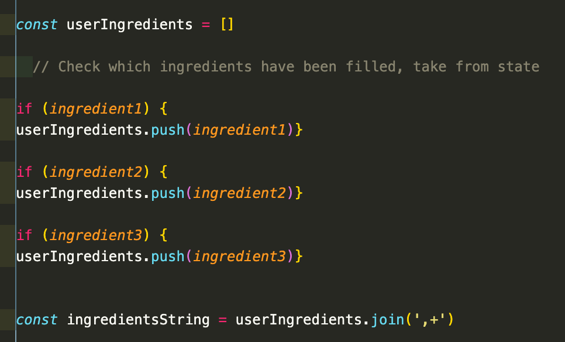

# sei-project-two

General Assembly Project 2 : Hackaton, make an app - The Lockdown Chef

## https://lockdown-chef.netlify.app/

## Goal: 
Hackaton of 2 days to create an app with React.js, axios and an online API pair coding.

Timeframe: 48 hours

## Table of Contents

- [Overview](#overview)
- [Process](#process)
- [Challenges](#challenges)
- [Technologies](#technologies)

## Overview

This project was the first time coding along with a partner. My partner and I decided to make an app about recipes, where you write the ingredients you have in home, to make dishes. 

## How to use it

In the middle of the screen you have input where you can write a maximun of 3 ingredients, you have to put at least one to find a recipe. After you write your ingredients, you only have to press the button and it should appear recipes with the ingredients you choose.

## Process

The starting point was to find an API with ingredients a recipes for our app, we find Spoonacular an wonderful food API, which a great number of recipes and we can filter them with the ingredients. In addition, it is a free API if you don't do more than 100 request per month.

After we got our API we started to design our App, we made a simple design with a logo and the name of the app. First we made request with axios to get the recipes, we checked with Insomnia if we recieved the recipes, later we put some text inputs for the fill the ingredients to filter the recipes.

Firstly, I started making the the design of the App with HTML5 and CSS, while my partner was making a logo for the app. After we have the design of the app. We started to make request to the API to get the recipes, we figured out that we need to adjust the URL to get the recipes filter by ingredients, we created a function to that join the ingredients in a string to filter the recipes.

Finally, we worked into making the appear the information of the recipes and we styled; images, name of the recipes and a link to the recipe to make the food.

## Challenges

This was the second project for the course. In this proyect, we have to make a request to the API of Spoonacular to get the list of recipes using the ingredients as references, it was tricky, we had to adjust the API URL to accept the ingredients for the research . One of the problems we had at the beginning it was when we tried to make to find recipes with multiple ingredients, we had to make an array with the ingredients which later we transform in a string to use in the request to get the recipes.

## Technologies

- React.js
- Axios
- CSS
- React router dom
- Git / GitHub
- Yarn
- Insomnia
- Netlify

